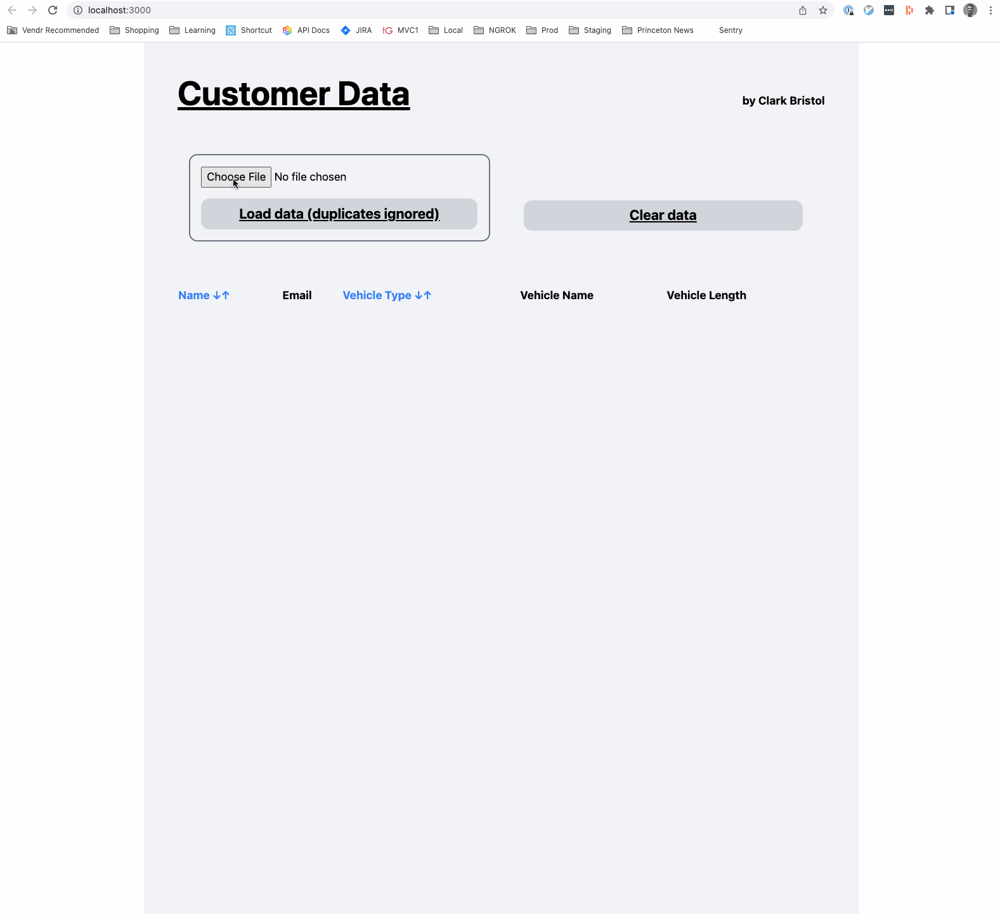

# **Welcome to the Outdoorsy "Customer Data" app!**



## **Running the App**

* Install and use the version of Ruby specified in the `.ruby-version` file (`ruby-3.0.1`).
* Run `bundle install` to install dependencies. (You might have to install `bundler` first)
* Run `bin/rails db:create` to create your local SQLite database. (You might have to install SQLite first)
* Run `bin/rails db:migrate`
* Run `bin/rails server` to start your local server
* Navigate to http://localhost:3000/ and start uploading and analyzing your business data!
* If you want some sample data to use, there are two files in the `data` directory here.

## **Using the App**

### Upload your data
Upload your CSV or pipe-delimited files containing your vehicle data or use the sample data
in the `/data` directory in this repo. Currently your data files must contain the following
columns in the following order and have **no header row**:

```
first_name,last_name,email,vehicle_type,vehicle_name,length
```

Here are two examples of valid input data file contents:

```
Greta,Thunberg,greta@future.com,sailboat,Fridays For Future,32’
Xiuhtezcatl,Martinez,martinez@earthguardian.org,campervan,Earth Guardian,28 feet
Mandip,Singh Soin,mandip@ecotourism.net,motorboat,Frozen Trekker,32’
Jimmy,Buffet,jb@sailor.com,sailboat,Margaritaville,40 ft
```

and

```
Ansel|Adams|a@adams.com|motorboat|Rushing Water|24’
Steve|Irwin|steve@crocodiles.com|RV|G’Day For Adventure|32 ft
Isatou|Ceesay|isatou@recycle.com|campervan|Plastic To Purses|20’
Naomi|Uemura|n.uemura@gmail.com|bicycle|Glacier Glider|5 feet
```

### Analyze your data
...by _looking at it_

### Sort your data
...by either name (last name + first name) or vehicle type

Enjoy!

## **Next steps**
* Add a system test exercising the application for our standard user flow: uploading multiple files, sorting, deleting
* Add unit tests for the `VehicleTextDataParser`
* Think about controller tests, but that might be overkill at this point if we have the other two. I want to make sure
  the sorting logic is covered
* The sorting feature for Vehicle Type is currently broken because SQLite sorts upper case letters before all lower case
  letters causing 'RV' to sort before 'bycycle'. We have at least two solutions to consider here
* I am currently pulling in all of the Tailwind styles via CDN. If we care about page performance we should deliver the
  styles to the browser ourselves and only send the ones we actually use on the page

## **Questions for Product/Users**
* As-built the app automatically de-duplicates data based on all fields (unless a field is NULL). Let's discuss!
* How do you use the 'Vehicle Length' data? Is the messiness a problem? Would you like it to be more consistent
  so it's easier to read, or numerical so you can do mathmatical operations with it?
* Do we want all of our users to be working with the same data, or do we want to segment it by user so when
  someone uploads more data or deletes data it only affects their experience?
* Should we make this look nicer?
* We currently have a denormalized data model, with person data alongside vehicle information in the vehicles table.
* Relatedly, add an ID column to our `vehicles` table as soon as we have a need for it.
* How much do we expect our data to grow? If it does, we will need to think through pagination and other options.
* As a best practice, we could factor out our text strings that driving the copy in the UI. This is critical
  if we ever want to support multiple languages, but would be a nice-to-have if not.
* So far the data we have for this application is clean and consistent. But CSVs come in all shapes and sizes. Let's
  discuss our data sources here and whether we need to be cleaning or validating our data.
* What feedback should we be giving users? Should we notify them then their upload is successful? What about when
  no rows are imported becaues they were all duplicates?
